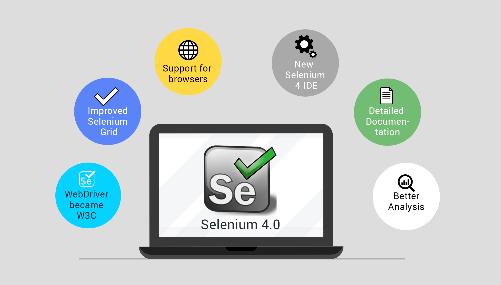
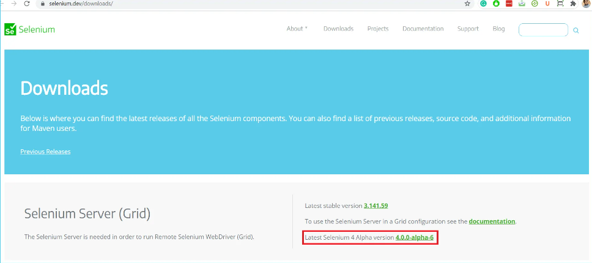

# Selenium
## What is Selenium?

**Selenium** is the most used automation tool in the market. The Selenium is constantly improving and changing as per market standards. Selenium 4 released with many useful features created hope in selenium testers.

**Selenium** is an umbrella project for a range of tools and libraries that enable and support the automation of web browsers.

**Selenium** is not just one tool or API but it composes many tools.



## INDEX
______
- [Topic discuss in this course](#topic-discuss-in-this-course)
  - [Introduction Selenium](#selenium)
  - [What is New in Selenium 4?](#what-is-new-in-selenium-4)
    - [Selenium IDE](#selenium-ide)
    - [Selenium WebDriver](#selenium-webdriver)
    - [Selenium Grid](#selenium-grid)
    -[Difference between Selenium 3 and Selenium 4](#difference-between-selenium-3-and-selenium-4)
    - [Selenium 3 vs Selenium 4](#selenium)
  - [Selenium 4 Features](#selenium-4-features)
    - [WebDriver changed to W3C Standardization](#webdriver-changed-to-w3c-standardization)
    - [Selenium Grid Optimization](#selenium-grid-optimization)
    - [Relative Locators](#relative-locators)
    - [Multiple Tabs & Windows](#multiple-tabs--windows)
    - [Browsers Support](#browsers-support)
    - [Selenium Integrated Development Environment](#selenium-integrated-development-environment)
    - [WebElement Screenshot](#webelement-screenshot)
    - [Monitoring](#monitoring)
  - [How To Upgrade From Selenium 3 To Selenium 4?](#how-to-upgrade-from-selenium-3-to-selenium-4)
  - [What is deprecated in Selenium 4](#what-is-deprecated-in-selenium-4)
  - [Conclusion](#conclusion)
  - [References](#references)


# Topic discuss in this course
* Introduction Selenium
* What is New in Selenium 4?
    * Selenium IDE
    * Selenium WebDriver
    * Selenium Grid
* Difference between Selenium 3 and Selenium 4
    * Selenium 3 vs Selenium 4
* Selenium 4 Features
    * WebDriver changed to W3C Standardization
    * Selenium Grid Optimization
    * Relative Locators
    * Multiple Tabs & Windows
    * Browsers Support
    * Selenium Integrated Development Environment
    * WebElement Screenshot
    * Monitoring
* Download Selenium 4
* How To Upgrade From Selenium 3 To Selenium 4?
* What is deprecated in Selenium 4
* Conclusion
* References

## What is New in Selenium 4?

## **Selenium IDE**

* To use this there is no need for extensive programming knowledge. It supports rapid test development. It is like a record and playback tool.

## **Selenium WebDriver**

* It automates browser and supports programming languages like Java, JavaScript, Python, Perl, etc.

## **Selenium Grid**

* Selenium Grid 4 allows us to run our test scripts across multiple machines or systems.

## Difference between Selenium 3 and Selenium 4

### Selenium 3.0

* JSON wire protocol was used to communicate between the Selenium Webdriver APIs and the browser native APIs. All the requests and responses communicated across the protocol were encoded & decoded.

### Selenium 4.0

* It follows the W3C standard protocol (driver and the browser communication follows the standard procedure) due to this request and the response communicated across the protocol doesn’t require the encoding and decoding API.

## Selenium 4 Features

* On October 13, 2021, Selenium 4 was released as a stable version, following the Alpha and Beta releases of its predecessor. The Selenium 4 features introduced are far more promising than anyone could have imagined, which is exactly what we’ll discuss in this section.

### WebDriver changed to W3C Standardization

* The major change in Selenium 4 is the standardization of the WebDriver API with respect to W3C standards to encourage compatibility across various software implementations. With this change, requests and responses communicated across the protocol don’t require the encoding and decoding API.

### Selenium Grid Optimization

* Selenium 4, Selenium Grid is coming up with improvised UI and stability by removing the issues occurred in the earlier version of Grid like installation, the connection between the hub and node.
  It allows us to execute the test cases in parallel on multiple operating systems, multiple browsers, and in different versions.

* Check this link for more information on [Selenium Grid](https://www.selenium.dev/documentation/grid/)

### Relative Locators

* Relative locators allow us to locate the WebElements by its position by concerning other web elements such as above, below, toLeftOf, toRightOf, and near.

    * There are five locators newly added in Selenium 4:
    * **above():** It is to locate a web element just above the specified element
    * **below():** It is to locate a web element just below the specified element
    * **toLeftOf():** It is to locate a web element present on the left of a specified element
    * **toRightOf():** It is to locate a web element present on the right of a specified element
    * **near():** It is to locate a web element at approx, 50 pixels away from a specified element

```java
//Assume element1 is above element2
WebElement element1;
element1 = driver.findElement(By.id("1234"));
String element2 = driver.findElement(withTagName("ABC").below(element1)).getText();
System.out.println("Element below element1 is "+ element2);

//Assume element0 is above element1
WebElement element1;
element1 = driver.findElement(By.id("1234"));
String element0 = driver.findElement(withTagName("ABC").above(element1)).getText();
System.out.println("Element above element1 is "+ element0);


//Assume element1 is on the left side of element3
WebElement element1;
element1 = driver.findElement( withTagName("ABC").toLeftOf(element3)).getText();
System.out.println(" Left of element 3 is : "+ element1);


//Assume element3 is on the right side of element1
WebElement element3;
element3 = driver.findElement( withTagName("ABC").toRightOf(element1)).getText();
System.out.println(" Right of element 1 is : "+ element3);
```

* Check out a detailed guide on [Selenium Relative Locators](https://www.softwaretestingmaterial.com/selenium-relative-locators/)

### Multiple Tabs & Windows

* With Selenium 4, we can work with multiple tabs or windows. We can open a new tab or window in the same session without creating a new driver object.

    * To create a new Tab by passing WindowType.TAB to newWindow() method
    * To create a new window by passing WindowType.WINDOW to newWindow() method

### Browsers Support

* Native support has been removed for Opera and PhantomJS. Since the WebDriver implementations for these browsers are no longer under active development.

    * If you are an Opera user then you can use Chrome.
    * If you are a PhantomJS user then you can use Chrome or Firefox in a headless mode.

### Selenium Integrated Development Environment

* Selenium IDE is a tool used to record and playback. It allows us to interact with browsers. The previous version of Selenium IDE was deprecated in the year 2017. The latest version of Selenium IDE is coming up with man more advanced capabilities.


### WebElement Screenshot

* Selenium 4 allows screenshots to be taken at different UI levels like element, section and full page. We will discuss why this feature is necessary and how it can be achieved in Selenium 4, along with sample code exxamples.

* Selenium 3 allows users only to capture a webpage and no provision to capture screenshot of a specific web element. Selenium 4 allows us to take a screenshot of a particular web element.

```java

WebElement screenshot =driver.Findelement (By.xpath("YourXpath"));
File srcFile = screenshot.getScreenshotAs(OutputType.FILE);
File dstFile = new File("Image.png");
FileUtils.copyFile(srcFile,dstFile);
```

## Monitoring

* Logging and request tracing processes have been improvised to fasten the debugging process which resolves the script issues easily.

## Download Selenium 4

* You can find Selenium 4 Alpha in the Maven repository. You can download it from [Selenium official website](http://www.seleniumhq.org/download)

## How To Upgrade From Selenium 3 To Selenium 4?

* If you would like to upgrade from Selenium 3 to Selenium 4 then you must check our step by step Selenium 4 Installation Guide to Install Selenium 4.
    * [Click Here for the Link](https://www.softwaretestingmaterial.com/install-selenium-4/)





## What is deprecated in Selenium 4

* Some of the methods deprecated in Selenium 4 are as follows
    * **FindsBy:** FindsBy interface is a part of org.openqa.selenium.internal package implemented by the RemoteWebDriver class. The methods in that are findElement(By), findElements(By).
    * **Actions:** The Actions class is used to emulate user gestures like mouse movements, hoverings etc., In the Selenium 4, some new methods have added to the Actions class as a replacement of the classes under org.openqa.selenium.interactions package.
    * **Fluent Wait:** The methods in the fluentwait such as withTimeout() and pollingEvery() have been modified.
    * **Driver Constructors:** Few driver constructors have been deprecated. Capabilities objects have been replaced with Options.

## Conclusion

* We have covered new features of Selenium 4.0 such as W3C standardization, brand new Selenium IDE, Relative Locators, Multiple Tab/Windows, and others. We hope Selenium 4.0 gives us the best experience and ability to do almost all the tasks which are unfulfilled in Selenium 3.

## References

* [Selenium 4 Official Documents](https://www.selenium.dev/documentation/webdriver/getting_started/upgrade_to_selenium_4/)
* [Selenium Features](https://rahulshettyacademy.com/blog/index.php/2021/10/24/selenium-4-key-features-whats-new/)
* [Udemy Course](https://www.udemy.com/course/selenium-real-time-examplesinterview-questions/)


  


